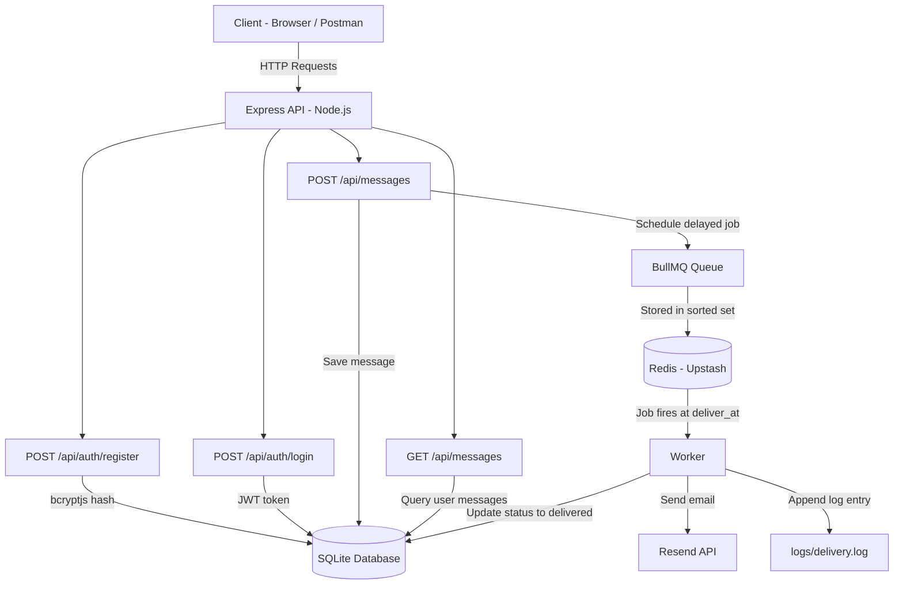

# My Approach - Time Capsule Messaging System

## Architecture Overview



---

## Tools Used

| Tool | Why |
|------|-----|
| **Node.js + Express** | Required by the assignment. Express v5 for async error handling. |
| **SQLite** (`sqlite3` + `sqlite`) | Lightweight, zero-config, no external DB server needed. WAL mode for concurrent reads. |
| **BullMQ + Redis** | Production-grade job scheduler. Stores delayed jobs in Redis sorted sets - no setTimeout, no in-memory state. |
| **Upstash Redis** | Free managed Redis with TLS. Jobs persist across server restarts. |
| **ioredis** | Redis client that handles `rediss://` TLS URLs natively. Required by BullMQ. |
| **JWT** (`jsonwebtoken`) | Stateless authentication. 24h expiry. No session storage needed. |
| **bcryptjs** | Pure JS password hashing. No native compilation issues across platforms. |
| **Resend** | Transactional email API. Works on Render (unlike Gmail SMTP which fails on IPv6). |
| **Docker + Docker Compose** | Local development with Redis. One command to run everything. |
| **Render** | Free tier deployment. Connects to Upstash Redis externally. |

---

## Key Decisions

### 1. Why BullMQ + Redis over Cron Polling?

I evaluated three approaches before choosing:

**Approach 1 - Cron polling (rejected):**
Poll the DB every minute for due messages. Simple, but 1,440 unnecessary DB calls/day even with zero messages. Good enough for small scale, but I wanted a production-grade solution.

**Approach 2 - Sleep until next message (rejected):**
Find the next scheduled message, sleep until that time. Breaks on server restart (sleep timer is in-memory). Violates the assignment constraint against setTimeout for long delays.

**Approach 3 - BullMQ + Redis (chosen):**
When a message is created, a delayed job is added to Redis with `delay = deliver_at - now`. BullMQ stores this in a Redis sorted set (ZSET) keyed by execution timestamp. The worker picks it up at exactly the right time.

**Why this wins:**
- Zero polling - no unnecessary DB calls
- Precise timing - delivers at the exact scheduled time, not on a 1-minute interval
- Restart-safe - jobs live in Redis, not in the Node process. Server restart = worker reconnects and continues
- Scalable - can add more workers independently of the API server
- No setTimeout - BullMQ uses Redis ZRANGEBYSCORE internally, not timers

### 2. Why SQLite over PostgreSQL?

- No external database server to manage or pay for
- Single file - easy to understand, deploy, and backup
- WAL mode enables concurrent reads while writing
- Good enough for thousands of messages
- I would switch to PostgreSQL if: the system needed horizontal scaling (multiple API servers), had high write concurrency, or needed advanced queries

### 3. Why Resend over Gmail SMTP?

Started with Nodemailer + Gmail SMTP. It worked locally but failed on Render:
- `ENETUNREACH` - Render's free tier doesn't support IPv6, and Gmail's SMTP resolved to an IPv6 address
- Even with `dns.setDefaultResultOrder('ipv4first')`, it was unreliable

Resend is a simple HTTP API call - no SMTP, no port issues, no IPv6 problems. Free tier gives 100 emails/day.

### 4. Why JWT over API Keys?

- Stateless - no session table needed, keeps the architecture simple
- Self-contained - the token carries the user ID and email, so the API never queries the users table on every request
- Standard - every HTTP client and testing tool (Postman, curl) supports Bearer tokens
- 24h expiry - balances security with convenience for testing

### 5. Why a Single Process (API + Worker)?

The API server and the BullMQ worker run in the same Node.js process. For this scale, separating them would add deployment complexity (two services on Render) for zero benefit. They share the same SQLite connection, which actually avoids SQLite's write lock contention.

At scale, I would split them: API servers behind a load balancer, workers as separate processes pulling from the same Redis queue.

---

## How Delivery Works (Step by Step)

1. User calls `POST /api/messages` with `deliver_at: "2026-06-15T09:00:00Z"`
2. Message is saved to SQLite with `status: "pending"`
3. `scheduleDelivery()` adds a BullMQ job to Redis:
   - `delay = deliver_at - Date.now()` (in milliseconds)
   - Job data: `{ messageId, recipientEmail }`
   - Stored in Redis sorted set, scored by execution timestamp
4. Time passes. BullMQ checks the sorted set and moves the job to the active queue when `deliver_at` arrives.
5. Worker picks up the job and:
   - Sends email via Resend API (skips gracefully if not configured)
   - Runs `UPDATE messages SET status='delivered', delivered_at=NOW() WHERE id=? AND status='pending'`
   - Appends `[2026-06-15T09:00:00Z] Delivered message 1 to friend@example.com` to `logs/delivery.log`
6. `GET /api/messages` now shows `status: "delivered"` with `delivered_at` timestamp

### What happens on server restart?

Nothing is lost. The delayed job lives in Redis (Upstash), not in the Node process. When the server restarts:
- Express starts, database initializes
- BullMQ worker reconnects to Redis
- Any jobs that became due during downtime are processed immediately
- Pending future jobs continue waiting in Redis as before

---

## Project Structure

```
src/
  index.js                  # Entry point - Express + worker startup
  config.js                 # Environment variables
  database.js               # SQLite connection + schema (users, messages tables)
  middleware/
    authenticate.js          # JWT verification middleware
  routes/
    auth.js                  # POST /api/auth/register, POST /api/auth/login
    messages.js              # POST /api/messages, GET /api/messages
  services/
    redis.js                 # ioredis connection factory
    queue.js                 # BullMQ queue + scheduleDelivery()
    worker.js                # BullMQ worker - processes delivery jobs
    mailer.js                # Resend email sender
    delivery-logger.js       # File logger for delivery events
  utils/
    password.js              # bcrypt hash/compare helpers
public/
  index.html                 # Frontend SPA (vanilla JS, no framework)
```

---

## Constraints Checklist

| Requirement | Status | Implementation |
|-------------|--------|----------------|
| Node.js | Done | Express v5 |
| SQLite | Done | sqlite3 + sqlite wrapper, WAL mode |
| REST API | Done | 4 endpoints + health check |
| Persistent storage | Done | SQLite file in `data/` directory |
| No setTimeout for scheduling | Done | BullMQ delayed jobs in Redis |
| No in-memory scheduling | Done | All state in Redis + SQLite |
| Survives server restart | Done | Redis persists jobs, SQLite persists data |
| JWT authentication | Done | 24h tokens, Bearer header |
| Users see only their messages | Done | `WHERE user_id = ?` filter |
| deliver_at must be future | Done | Server-side validation |
| Message max 500 chars | Done | API validation + DB CHECK constraint |
| No editing after creation | Done | No PUT/PATCH endpoint exists |
| Status tracking | Done | pending -> delivered |
| Delivery logging | Done | `[timestamp] Delivered message X to email` |
| Deployed | Done | Render (API) + Upstash (Redis) |
